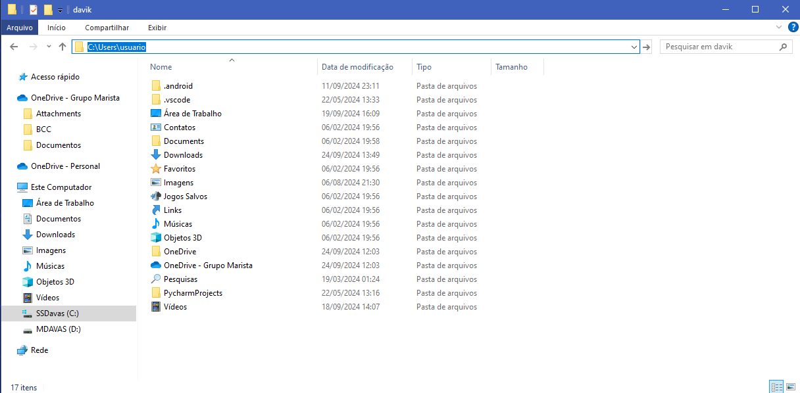

# Organizador de Arquivos

## Descrição

Este projeto é um organizador de arquivos em pastas desenvolvido em python

## Requisitos

Para a execução do programa, você só precisa ter o Python 3 instalado em sua máquina e uma IDE da sua escolha para executar ou, caso queira, pode ser executado no próprio prompt de comando

## Utilização

Após executar o programa, você deve inserir no terminal o diretório da pasta que deseja organizar. Exemplo: 

``` bash 
C:\User\usuario\Downloads
```

Para obter o diretório, basta abrir a sua pasta no explorador de arquivos, clicar na barra superior e copiar (Crtl + C)



## ATENÇÃO!!

Ao executar o código e fornecer o diretório, os arquivos serão organizados nas pastas imediatamente e não há como reverter.

## Desenvolvimento

Para o desenvolvimento do programa, foram utilizadas as bibliotecas:
- os
- shutil

para a manipulação dos diretórios e dos arquivos.